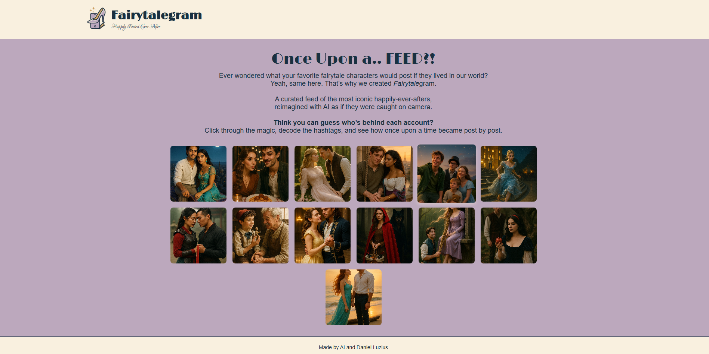
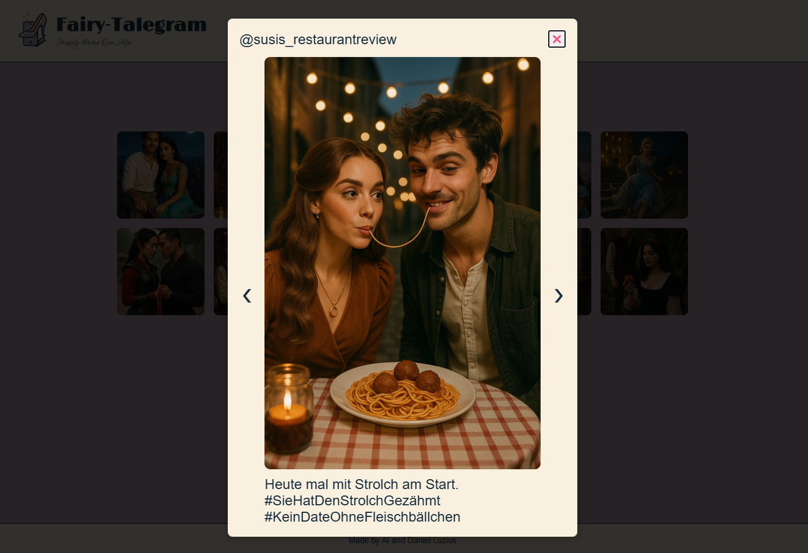

# 📸 Fairytalegram – Happily Posted Ever After

**Fairytalegram** is a playful web gallery that imagines what iconic fairytale characters would post if they had social media. Built with HTML, CSS, and JavaScript, it features an interactive, fully responsive photo feed filled with AI-generated images and witty captions.

## ✨ Project Concept

> *"Once Upon a... Feed?!"*  
Ever wondered what Cinderella, Peter Pan, or Ariel would share online?  
Fairytalegram brings classic fairytales into the digital age — one magical post at a time.

Scroll through a curated gallery, open each post to reveal captions and usernames, and guess who's behind the feed. From magical selfies to suspicious apples, this feed has it all.

## 🛠️ Technologies Used

- **HTML5** – Semantic structure
- **CSS3** – Custom fonts, responsive design, transitions
- **JavaScript** – Dynamic rendering, modal popups, navigation logic

## 💡 Features

- 🖼️ Image gallery of fairytale characters  
- 📱 Responsive design with `clamp()` for font scaling  
- 📸 Modal popup with username and caption  
- ➡️ Navigate left/right through posts  
- 🌐 Runs entirely in the browser (no backend)

## 🧾 File Structure

- 📁 img/ → AI-generated images
- 📄 index.html → Main page and layout
- 📄 style.css → Styling and responsiveness
- 📄 script.js → Logic for rendering & interactivity

## 👇 Screenshots 👇

